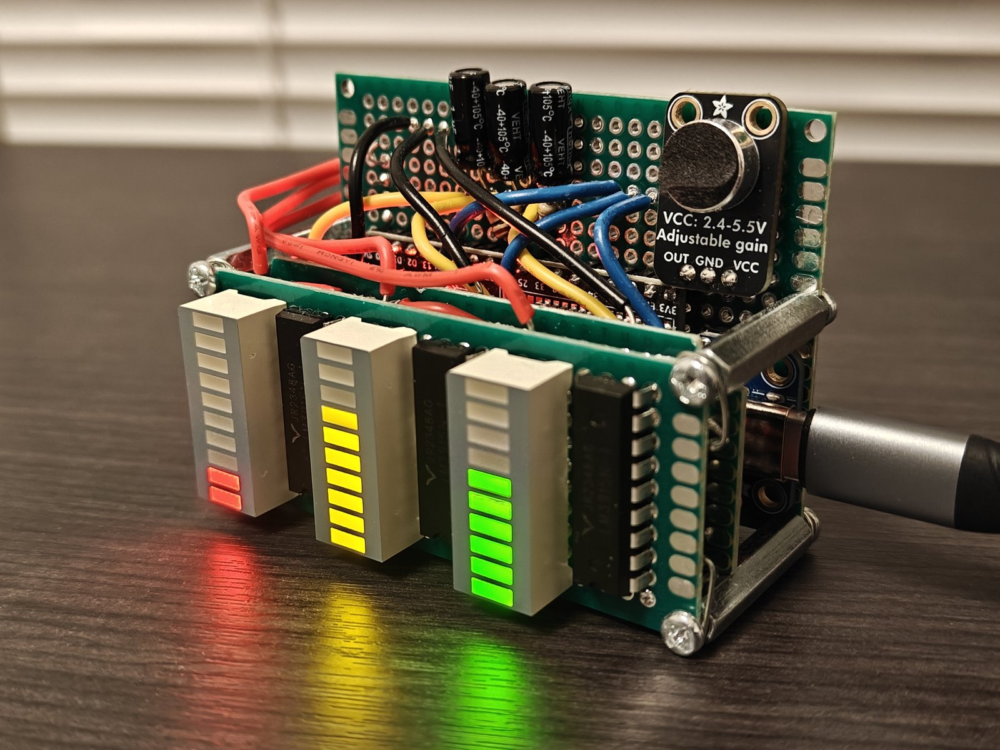
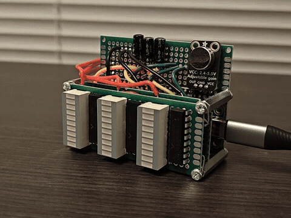
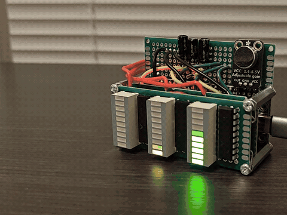
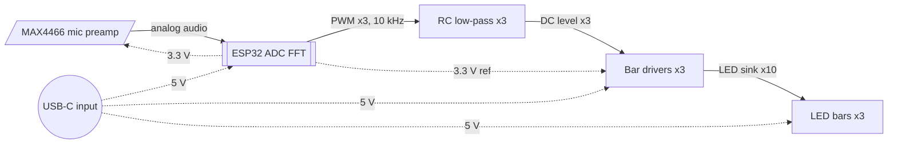

# Audio Spectrum Visualizer

*A desk light display that listens to the room and shows the bass, mids and treble of whatever is playing as three LED bars — tuned to look good, not to measure.*



**Status:** Complete · **Platform:** ESP32 (ESP32-DevKitC-32UE) · **Built with:** C++ (Arduino), Arduino IDE, FNIRSI 2C53T oscilloscope and multimeter · **Built:** July–September 2026

## Documentation

| File | What's in it |
|---|---|
| [hardware/README.md](hardware/README.md) | Full circuit design, component selection, construction |
| [hardware/interconnect.md](hardware/interconnect.md) | Signal-by-signal pin map |
| [firmware/notes.md](firmware/notes.md) | Module structure, algorithms, timing |
| [test/README.md](test/README.md) | Measurement setup, methodology, full results |
| [docs/design-decisions.md](docs/design-decisions.md) | Every decision made and rejected, with reasoning |
| [docs/lessons-learned.md](docs/lessons-learned.md) | What I learned building this |
| [docs/development-log.md](docs/development-log.md) | How the project actually unfolded |
| [docs/audio-spectrum-visualizer-onepager.pdf](docs/audio-spectrum-visualizer-onepager.pdf) | One-page summary for print |

Licensed MIT — see [LICENSE](LICENSE).

## What it does

A desk light display for anyone who likes to see their music. A microphone listens to the room; an ESP32 microcontroller samples the sound about 23,100 times a second, splits it into bass (80–300 Hz), mids (300 Hz–4 kHz) and treble (4–10 kHz) with a Fast Fourier Transform, and drives three 10-segment LED bars 19.6 times a second. It needs no calibration: each bar scales itself to the room's own noise and to the music's recent peaks. It was built to look good on a desk, not to measure sound: the bars are not comparable to each other, and that trade was made on purpose.



*A tone swept by hand from about 100 Hz to 20 kHz and back, played through a speaker out of frame: bass, mid, treble, then in reverse.*



*A few seconds of music, recorded to show the bars moving independently; it is not a measurement. Measured results are in the table below.*

## Results

| Metric | Value | Conditions | How measured |
|---|---|---|---|
| Sample rate the firmware actually achieves | 23,107–23,124 Hz | final firmware, loop requests 32 kHz; 23 consecutive status lines | firmware timing of each 1,024-sample block (`micros()`) |
| Display update rate | 19.6 frames/s | same | firmware frame timer |
| Driver-chip LED thresholds (chips sold as logarithmic LM3915) | 0.31, 0.63 … 2.96, 3.26 V; mean step 0.328 V | three chips from the same batch on a breadboard test rig, full scale tied to 3.3 V | voltage at the input pin as each LED turned on ([test](test/README.md#m1--driver-thresholds)) |
| ESP32 ADC transfer at 11 dB attenuation | 1,276 counts/V, within ±21 counts of a straight line from 0.24 to 2.65 V; reads high above 2.65 V; 4095 by 3.25 V | 17 points, 0.05–3.25 V | multimeter on GPIO34 against the raw-ADC sketch |
| Microphone swing on loud music, gain at maximum | 600–3,290 counts (roughly 0.60–2.69 V) | music louder than normal listening, mic in place | raw-ADC sketch min/max, converted with the ADC curve of a same-model ESP32 |
| Supply current at the 5 V input | 70.7 mA bars dark · 90–120 mA music · 237.5 mA highest seen | music from a speaker at normal and at maximum volume | FNIRSI 2C53T, DC current, in series with the 5 V input |
| USB-C input voltage | 5.178 V | breakout on a USB-C source, before connecting the circuit | multimeter |
| Top LED on every bar | lights and stays solid at full-scale duty (1023) | all three bars; LED 10 turns on at 3.26 V against a 3.3 V full scale | observation plus the threshold measurement |

## System architecture



At power-on the ESP32 starts sampling straight away, with no calibration step. Each frame, every band's level in decibels is placed in a window from the room's noise floor to the band's recent peak; that position becomes a PWM duty, the RC filter turns it into a voltage, and the driver lights that many LEDs.

## Hardware

The input is an Adafruit MAX4466 microphone board with a fixed, hand-set gain; automatic gain would flatten the dynamics the bars exist to show. It runs from 3.3 V so its output stays inside the ESP32's input range.

Each bar is driven by a chip marked "LM3915", a logarithmic bar-graph driver. Its measured switching points showed a counterfeit linear part, so the logarithmic scale comes from firmware. Each chip's input is a 10 kHz PWM signal smoothed by a 10 kΩ + 1 µF filter. Power enters through an Adafruit USB-C breakout whose built-in CC resistors let any USB-C charger or power bank supply 5 V.

Three perfboards stacked on metal standoffs, soldered directly with no IC sockets. Full writeup: [hardware/README.md](hardware/README.md); every connection: [hardware/interconnect.md](hardware/interconnect.md).

## Firmware

One 155-line Arduino sketch. Each frame captures 1,024 samples, removes the DC offset, applies a Hann window, runs an FFT and measures each band in decibels. Per band, a slow noise floor follows the room when it is quiet, a window top follows recent peaks, and the bar jumps up instantly and falls smoothly. Constants are in decibels or seconds, scaled by the measured frame time. Details: [firmware/notes.md](firmware/notes.md).

The firmware was written with AI assistance.

## Design decisions

- **Linear driver, logarithmic display.** The counterfeit chips switch every 0.33 V. The firmware sends a voltage proportional to decibels, so each LED becomes one equal decibel step.
- **Fixed-gain microphone.** Automatic gain flattens loud against quiet. The gain was set once, at maximum, after loud music measured 600–3,290 of 4,095 counts with no clipping.
- **A 23.1 kHz blocking sampler with no anti-aliasing filter.** At this rate, 13–19 kHz hi-hat energy folds into the treble band, where music has under 5 % of its energy. Faster DMA sampling lost that and looked worse; it only pays off for a measuring device.
- **Looks over accuracy.** Each bar scales to its own noise floor and peaks: lively at any volume and distance, but bar heights are not comparable between bands.
- **USB-C with CC resistors, not a USB-PD trigger board.** The breakout asks for plain 5 V; a trigger board can negotiate up to 20 V and destroy the circuit.

Every decision, including the rejected ones: [docs/design-decisions.md](docs/design-decisions.md).

## Problems solved

**Driver chips that were not what they said.** The display came out linear. Driving a chip's input from a potentiometer with a multimeter on it, the ten LEDs switched at evenly spaced voltages, 0.31 to 3.26 V. A genuine LM3915 switches at 3 dB ratios, bunched near the bottom, and no wiring can make it linear. The chips were counterfeit; the logarithm moved into firmware.

**A bar that stopped at LED 8.** With 3.3 V on the input, the bar never passed LED 8. A leftover wire from an earlier trimmer setup still tied full scale to the chip's internal reference, about 4 V. Tying full scale to 3.3 V alone fixed it.

**Treble went dead when sampling got faster.** Sampling at 32 kHz through the ESP32's DMA path, the treble bar barely moved. At 23.1 kHz, hi-hat energy above 13 kHz had been folding into the treble band; at 32 kHz it landed above it. The slower sampler was kept.

## What I learned

- Aliasing moves content rather than losing it; here the mirrored 13–19 kHz content carried the hi-hats.
- A part is what it measures, not what it is marked: evenly spaced thresholds identify a linear driver in minutes.
- A PWM pin and an RC filter make a usable DAC when the corner sits far below the PWM frequency: 15.9 Hz against 10 kHz leaves about 5 mV of ripple against a 330 mV LED step.
- Treble is the weakest band on a room microphone: music puts under 5 % of its energy there, while the microphone's hiss is spread evenly.
- A USB-C sink gets 5 V only after it identifies itself with 5.1 kΩ on both CC pins.

## What I'd do differently

- Run the complete system on a breadboard before final assembly. Each block was proven alone, but the display firmware was developed on the finished stack, where the microphone's limits could only be worked around.
- Protect the microphone capsule while soldering; its cover began to lift.
- For an accurate spectrum display, use a line input with an external audio ADC that filters aliasing itself, and sample continuously.
- Fix power-on: the noise floor can start far from the room's level and stay there until a reset ([firmware/notes.md](firmware/notes.md#known-limitations)).

## Repository layout

```
audio-spectrum-visualizer/
├── README.md                       # this file
├── LICENSE                         # MIT
├── .gitignore
├── hardware/
│   ├── README.md                   # full circuit design writeup
│   ├── interconnect.md             # every connection, pin by pin
│   ├── bom.csv                     # parts with reference designators and prices
│   ├── schematic.pdf               # drawn from the verified netlist
│   ├── schematic-excerpt.png       # driver channel and power input
│   └── wiring-diagram.png          # connectivity map (no PCB)
├── firmware/
│   ├── README.md                   # build and flash
│   ├── notes.md                    # design depth
│   └── src/
│       ├── fft_spectrum_visualizer/  # the firmware running on the device
│       └── adc_readout/              # raw-ADC tool used for gain setup and the ADC curve
├── test/
│   ├── README.md                   # methods and full results
│   ├── comparison-01.png           # driver thresholds: measured vs LM3915 datasheet
│   ├── comparison-02.png           # ESP32 ADC: measured vs straight line
│   ├── measurement-01.png          # scope: PWM and filtered voltage, high level
│   └── measurement-02.png          # scope: PWM and filtered voltage, mid level
├── docs/
│   ├── design-decisions.md
│   ├── lessons-learned.md
│   ├── development-log.md
│   └── audio-spectrum-visualizer-onepager.pdf
└── media/                          # photographs and animations
```

## Build and reproduce

You need the parts in [hardware/bom.csv](hardware/bom.csv), perfboard, wire, a soldering iron and a multimeter.

1. Wire it as in [hardware/interconnect.md](hardware/interconnect.md), with the LED ground and the microphone ground on separate wires to one point.
2. Check the USB-C breakout reads about 5 V before connecting it.
3. Flash [adc_readout](firmware/src/adc_readout/adc_readout.ino) and set the microphone gain so your loudest music stays clear of 0 and 4095.
4. Flash [fft_spectrum_visualizer](firmware/src/fft_spectrum_visualizer/fft_spectrum_visualizer.ino) as in [firmware/README.md](firmware/README.md), power it from USB-C and play music. If the bars look stuck after power-on, press EN.
