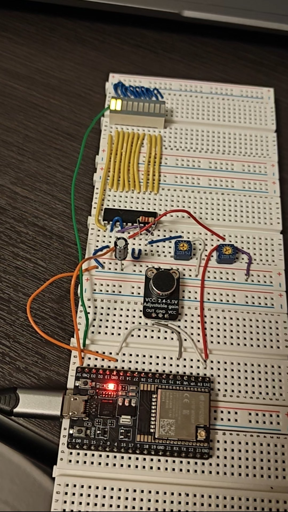
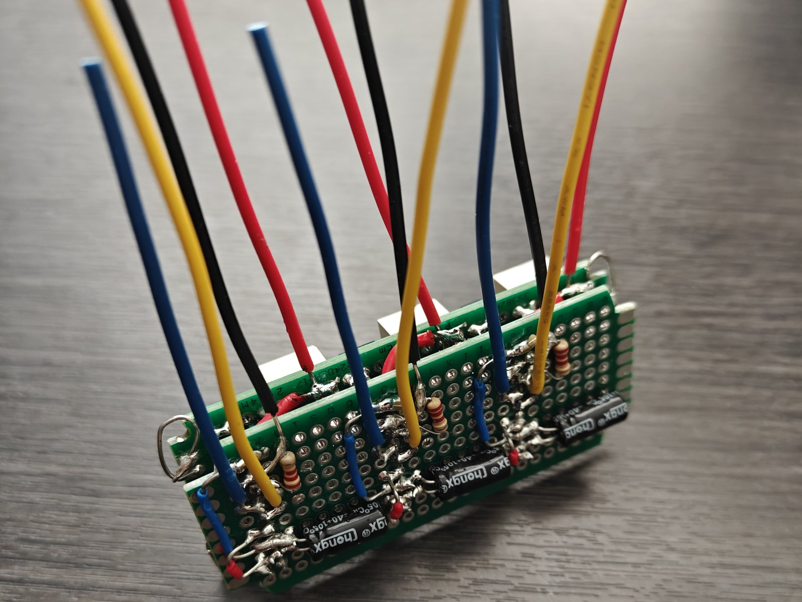

# Development log

How the build actually went, in order. Stages are not dated.

## 1 · Scope and parts

The brief was two chains that fail independently: a signal chain (microphone, sampling, FFT, three numbers) and a display chain (three numbers, three bars). Version 1 was to print three numbers that track bass, mids and treble; version 1.5 was to drive three LED bars from them.

Parts were chosen before anything was built: a classic ESP32 for its floating-point unit, a fixed-gain MAX4466 microphone rather than an automatic-gain one, LM3915 drivers for a logarithmic scale in hardware, and three 10-segment bars from one SunLED family so the colours would be similarly bright. A resistor kit and a capacitor kit covered the passives.

## 2 · Toolchain and first light

The first blink test uploaded cleanly but the LED never lit. Wiring the LED straight across 3.3 V proved the LED and resistor were fine; the fault was the pin, GPIO34, which is input-only. Moved to GPIO23, it blinked. GPIO34 became the microphone input, which is what input-only pins are for.

## 3 · FFT on generated data

Before connecting the microphone, the FFT ran on a signal generated in code: a 120 Hz tone and a 5 kHz tone at half its amplitude, plus a DC offset. The 5 kHz tone landed exactly in its predicted bin, 160; the 120 Hz tone fell between bins 3 and 4 and leaked into both; the peak heights kept the 2:1 amplitude ratio. The signal chain worked before any hardware was involved.

## 4 · Microphone into the FFT

With the real microphone the sample rate measured about 22–23 kHz, not the 32 kHz requested: each ADC read took longer than its time slot. The band edges were recomputed from the measured rate so they stayed in the right place.

Turning the spectrum into three usable numbers took several attempts. Raw sums let the wide treble band's noise dwarf the narrow bass band; averaging per bin diluted a single tone to nothing; a floor per band left a large fluctuating residual. A noise floor tracked per FFT bin finally made a quiet room read near zero. Band behaviour was checked objectively, with an online tone generator played through a speaker, rather than by ear.

## 5 · One display channel

The driver was first driven from a potentiometer, with no ESP32 involved. Three faults came up. LED polarity could not be read with the meter's diode test, which supplies too little voltage for these LEDs; 3.3 V through a resistor showed it. The display fell into dot mode although the mode pin measured correctly, caused by two stray wires from rewiring. And the bar stopped at LED 8, because full scale was still tied to the chip's internal reference from an earlier trimmer setup.

Then the logarithmic check: the thresholds were evenly spaced, about 0.33 V apart. The chips were counterfeit linear parts. Genuine LM3915s being obsolete, the decision was to keep these and produce the logarithm in firmware.

The same channel was then driven from the ESP32 through the PWM and RC filter.

## 6 · Gain and power

A small sketch that prints the raw ADC minimum and maximum was used to set the microphone gain before the trimmer became hard to reach. At maximum gain, loud music spanned 600–3,290 counts with no clipping, and the trimmer was left there. Power moved to an Adafruit USB-C breakout, whose built-in CC resistors let a USB-C charger or power bank supply 5 V.

## 7 · Perfboard

The circuit moved to three perfboards stacked on metal standoffs, with every part soldered directly and the microphone board mounted so its gain trimmer stays reachable. Each driver got its own 10 µF bypass capacitor, and the LED ground and the microphone ground run separately to one point. The microphone capsule's protective cover began to lift during soldering.

## 8 · Display firmware

The display firmware was developed on the finished stack. It took many attempts. A first large version added logarithmic scaling, automatic gain and peak hold; on the bench it looked like it was measuring rather than moving with the music, and music from a phone a metre away did not register at all. That version was cut back and later abandoned.

The final line started again from the simple sketch and changed one mechanism at a time: band levels in decibels, a noise floor that learns only from quiet frames, and a window top that follows each band's peaks. With those, the bars were dark in a quiet room and moved with music at any volume. The remaining problem was a weak treble bar. That is physics as much as code: music has little energy up there and the microphone's hiss does not. The treble bar was given a display curve and a slower fall, and I tuned the gates, fall rates and curve on the bench against the same song at several distances, including a voice across a 10 × 10 ft room.

## 9 · DMA, and why it was dropped

Sampling through the ESP32's DMA driver at 32 kHz was tried to remove the sampling gap. The treble bar went nearly dead. At 23.1 kHz, hi-hat energy from 13–19 kHz had been folding into the treble band; at 32 kHz it landed above the band. A DMA version at the old 23.1 kHz rate also looked worse, for reasons not found. The blocking sampler and its fold were kept, and the decision was made explicit: this device is for looks, not accuracy.

## 10 · Measured

With the build finished: the driver thresholds of three chips and the ESP32's ADC transfer curve, on a breadboard test rig because the device's chips are soldered in; the supply current at the 5 V input, the USB-C voltage, and the PWM and filtered voltage on an oscilloscope. Results are in [test/README.md](../test/README.md).
