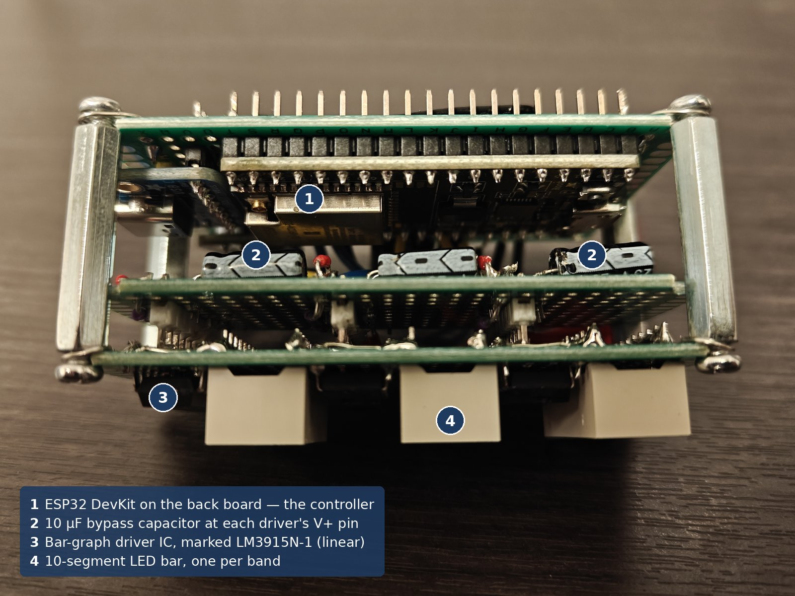
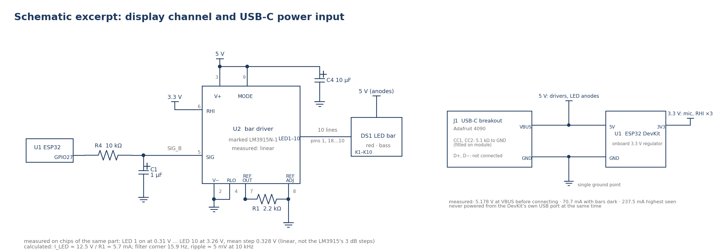
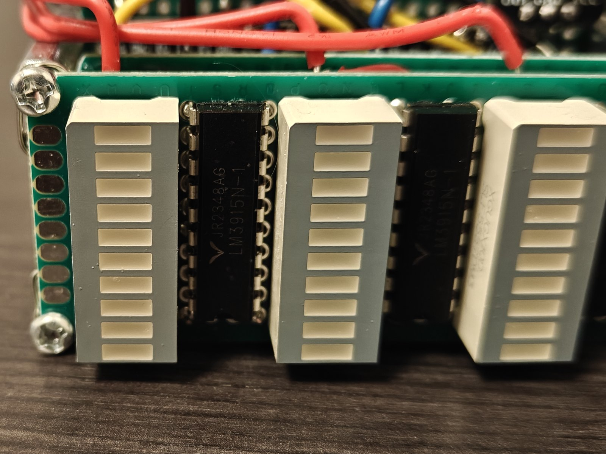
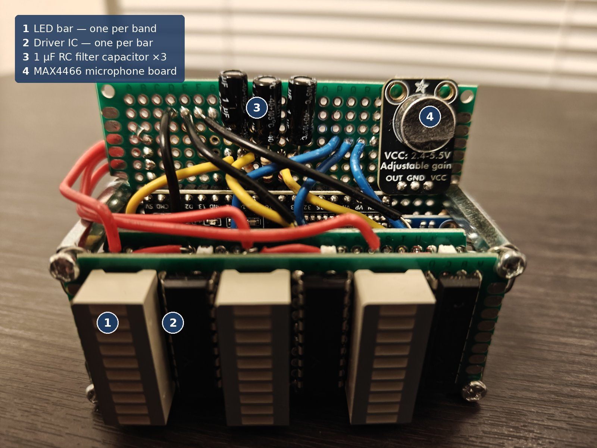
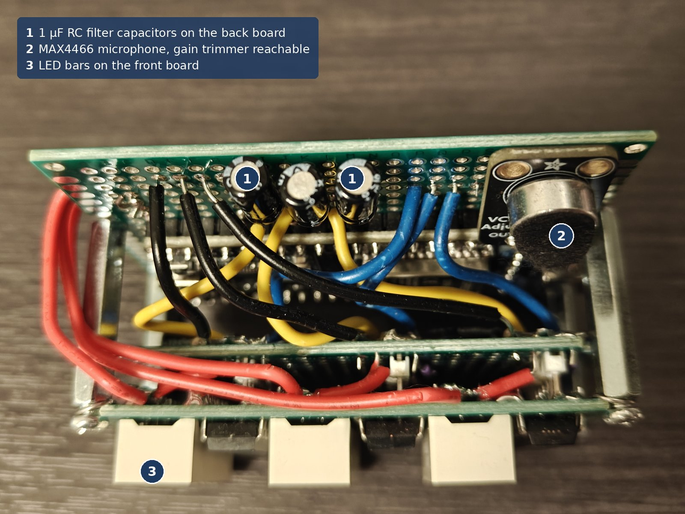
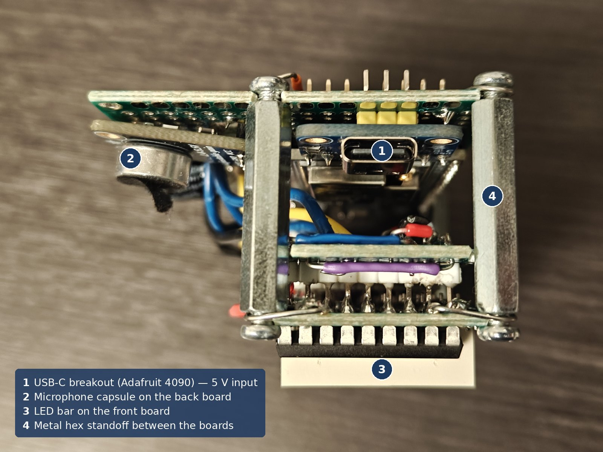

# Hardware

The circuit is two chains that meet at the ESP32: an input chain that turns room sound into numbers, and a display chain that turns three numbers into three lit bars. They were built and proven separately, so a fault always shows which side it is on.



[Schematic (PDF)](schematic.pdf) · [wiring map](wiring-diagram.png) · [interconnect table](interconnect.md) · [bill of materials](bom.csv)



## Architecture

```
room sound → MAX4466 preamp → ESP32 GPIO34 (ADC) → FFT, 3 band levels
           → 3 × PWM (GPIO27 / 26 / 25) → 3 × RC low-pass → 3 × bar driver → 3 × 10-LED bar
USB-C 5 V → ESP32 5V pin → onboard 3.3 V regulator → microphone, driver full-scale reference
          → driver supply and LED anodes (directly, not through the regulator)
```

There is one logic domain, 3.3 V, and one 5 V rail. Every ground returns to a single point.

## Subcircuits

**Microphone front end.** The Adafruit MAX4466 board is an electret capsule with an op-amp preamplifier whose output idles at half its supply. It is powered from 3.3 V, not 5 V: at 5 V the output would centre at 2.5 V and could swing to 5 V, beyond what the ESP32's ADC pin tolerates. At 3.3 V it centres near 1.65 V and stays in range. The output goes straight to GPIO34 with no coupling capacitor; the firmware removes the DC offset by subtracting each block's mean. GPIO34 is an input-only pin on ADC1, which does not share hardware with the Wi-Fi radio as ADC2 does.

The gain trimmer is set to maximum. **[MEASURED]** On music played louder than normal listening, with the microphone in place, the input swung between 600 and 3,290 of 4,095 counts with no clipping. A close-range cough did clip it, which is why the test used the real source at the real distance rather than a point-blank event. The trimmer's range is narrow (25× to 125×, per Adafruit's product page), so it acts as a fine adjustment rather than a volume control. The perfboard layout leaves the trimmer reachable without the board sticking out.

**ADC input range [MEASURED].** At 11 dB attenuation the ESP32 read 1,276 counts per volt, within ±21 counts of a straight line from 0.24 to 2.65 V (readings wandered ±15 counts). Below about 0.13 V it reads 0. Above 2.65 V the readings run high: 3,550 counts at 2.85 V where the line predicts about 3,470, 3,950 at 3.05 V against about 3,720, and 4,095 by 3.25 V. The curve was measured on a second ESP32 of the same model, so for the device's own chip the conversions are approximate. On it, the silent-room reading of about 1,940 counts corresponds to about 1.66 V, consistent with the preamp idling at half of 3.3 V, and the loud-music peak of 3,290 counts corresponds to about 2.69 V, just where the curve starts to run high. The full curve is in [test/README.md](../test/README.md#m2--esp32-adc-transfer-curve).

**PWM to voltage, per channel [CALCULATED, with measurement].** Each bar needs one steady voltage. The ESP32's LEDC peripheral produces a 10-bit, 10 kHz PWM signal whose average is duty × 3.3 V, and a 10 kΩ + 1 µF low-pass filter extracts that average: fc = 1 / (2π · 10 kΩ · 1 µF) = 15.9 Hz, τ = 10 ms. The corner sets how fast the bar can move, not which pitches are shown; the display updates 19.6 times a second, so a faster corner would only pass frame-to-frame jitter. Single-pole attenuation at 10 kHz is about 15.9 / 10,000, leaving roughly 5 mV of ripple against a 330 mV step between LEDs. The LEDC limit is f_pwm × 2^bits ≤ 80 MHz; 10 kHz × 1,024 = 10.24 MHz. On the oscilloscope the 3.3 V square wave at the pin became a steady level at the driver input; at 1 V/div the ripple was below what the scope could resolve.

**Bar drivers and LED bars.** Each channel uses one 18-pin bar-graph driver: ten comparators on a resistor ladder between RLO (pin 4, tied to ground) and RHI (pin 6, tied to 3.3 V), so full scale is exactly the PWM's maximum. The chips are marked LM3915, which should switch at 3 dB steps. **[MEASURED]** On a breadboard test rig they switch at evenly spaced voltages instead, 0.31 V for LED 1 to 3.26 V for LED 10, a mean step of 0.328 V: they are counterfeit linear parts, electrically an LM3914. Because the firmware sends a voltage proportional to decibels, a linear ladder still gives a logarithmic display, one equal decibel step per LED. LED 10 turns on 40 mV below full scale and stays solid at full-scale duty on all three bars.



*The marking claims an LM3915, a logarithmic driver. The measured thresholds are evenly spaced, which only a linear driver produces.*

The driver sinks LED current rather than sourcing it: LED anodes go to 5 V and the chip pulls each cathode low. It regulates that current itself, so the LEDs need no series resistors, and one resistor from REF OUT (pin 7) to ground through REF ADJ (pin 8) sets it for all ten: I_LED ≈ 12.5 V / R1. The design called for 1.2 kΩ, about 10.4 mA per LED. None was on hand, so 2.2 kΩ was tried with all three bars: about 5.7 mA per LED **[CALCULATED]**, well inside the bars' 25–30 mA ratings, bright enough, and closely matched across the three colours by eye. It stayed, one value for all three. MODE (pin 9) is tied to V+ for bar mode. Each chip has a 10 µF capacitor soldered at its V+ pin, because the datasheet warns that bar mode can oscillate without one; a single shared capacitor elsewhere on the rail would not protect the chips it is not next to.

**Power input [MEASURED].** Power enters through an Adafruit USB-C breakout (product 4090), whose VBUS feeds the ESP32's 5V pin. The breakout already carries 5.1 kΩ resistors from CC1 and CC2 to ground, which is how a USB-C sink tells a charger it wants default 5 V; without them many USB-C chargers never switch VBUS on. Both CC pins are terminated because the plug can go in either way round. D+ and D− are unused. The breakout measured 5.178 V before anything was connected. The device runs from a USB-C wall adapter or a power bank; the DevKit's own USB port is used only for flashing and never at the same time as the breakout.

## Power tree and current budget

| Rail | Source | Feeds |
|---|---|---|
| 5 V | USB-C breakout VBUS | ESP32 5V pin, driver V+ (×3), all LED anodes |
| 3.3 V | ESP32 onboard regulator | ESP32, MAX4466, driver RHI (×3) |

LED current flows on the 5 V rail directly, so the 3.3 V regulator carries only the ESP32, the microphone and three reference inputs.

**[MEASURED]** at the 5 V input, FNIRSI 2C53T on DC current in series: 70.7 mA with every bar dark; 90–120 mA with music at normal volume and roughly half the LEDs lit; 237.5 mA highest seen at maximum volume, with a few LEDs still unlit. **[CALCULATED, with measurement]** All 30 LEDs at 5.7 mA add about 170 mA to the 70.7 mA base, about 241 mA in total, consistent with the measured peak. Any USB source rated 0.5 A or more has margin.

Driver dissipation with all ten LEDs lit is about (5 V − 2 V) × 5.7 mA × 10 ≈ 0.17 W per chip **[CALCULATED]**, using the yellow bar's 1.95 V typical forward voltage.

## Component selection

| Part | Why this one | Considered instead |
|---|---|---|
| ESP32-DevKitC-32UE | hardware floating-point unit and enough RAM for a 1,024-point float FFT, while still requiring the sampling loop and FFT to be written by hand | Arduino Uno/Nano (2 KB RAM, fixed-point), Teensy 4 (its audio library hides the FFT), ESP32-C3/C6 (no floating-point unit) |
| Adafruit MAX4466 (1063) | fixed manual gain, so the signal shows real dynamics | MAX9814 with automatic gain control |
| "LM3915N-1" driver ×3 | wanted for a hardware logarithmic scale; measured linear | genuine LM3915 (obsolete), LM3914 (linear) |
| SunLED XGUGX10D / XGURX10D / XGUYX10D | one family with comparable brightness, 25–30 mA ratings | a brighter red rated only 10 mA; two 5-segment bars per band |
| Adafruit USB-C breakout (4090) | CC resistors already fitted, plain 5 V | a USB-PD trigger board |

## Cost

| Item | Cost | Basis |
|---|---|---|
| Parts fitted, bought from DigiKey (ESP32 board, microphone board, one USB-C breakout, three LED bars) | $32.55 | quoted |
| Also on the DigiKey order: a second USB-C breakout, 3 × 10 kΩ and 3 × 50 kΩ trimmers used during bring-up and later dropped | $11.11 | quoted |
| Driver chips, 10-pack | about $11 | estimated |
| Resistor and capacitor kits (reusable across projects) | about $21 | estimated |
| Perfboard, standoffs, wire, headers | — | already owned |

About $76 in total, of which $43.66 is quoted and the rest estimated. The DigiKey part numbers are in [bom.csv](bom.csv).

## Construction

The device is three perfboards stacked face to face on metal hex standoffs, which also give it a base wide enough to stand upright on a desk. Every part is soldered directly, including the three driver ICs; there are no DIP sockets, so replacing a driver means desoldering it.

- **Front board.** Its front face carries the three LED bars and the three driver chips. On its back, all LED anodes are joined to 5 V and each cathode is wired to its driver output. The drivers' remaining pins go through male-to-male headers, which are both the connection and the spacer to the middle board.
- **Middle board.** The rest of each driver's circuit: the 2.2 kΩ current-set resistors and the 10 µF bypass capacitors. Wires leave it for the back board: the three SIG lines, 3.3 V, 5 V and ground.
- **Back board.** One larger board, as wide as the other two, with an extra section rising above them. Every part is on its front face. At the bottom, hidden behind the other boards, are the ESP32 DevKit and the USB-C breakout, their ports pointing out of opposite sides. The upper section, visible above the stack, carries the microphone board and the three RC filters (the 10 kΩ resistors are hard to see; the 1 µF capacitors are visible). The back of this board carries the remaining connections and the single ground point.







## Assembly notes

- Ground the LED and driver return and the microphone and ESP32 return on separate wires to one point. The LEDs switch up to about 170 mA with the music; if that current shared a wire with the microphone ground, the voltage it drops would look like audio to the ADC.
- Keep the microphone signal wire away from the three PWM wires; 10 kHz sits just above the treble band.
- If the 1 µF filter capacitors are electrolytic, the positive lead goes to the filter node, which is always positive.
- Check the USB-C source reads 5 V before connecting it; a USB-PD trigger board in the same footprint can negotiate 9–20 V.
- Take care with heat near the microphone capsule. On this build the capsule's protective cover began to lift during soldering.

## Known compromises

- The drivers are counterfeit linear parts, soldered in place. The display is logarithmic only because the firmware makes it so.
- There is no anti-aliasing filter in front of the ADC, deliberately: the fold carries hi-hat energy into the treble band (see [docs/design-decisions.md](../docs/design-decisions.md)).
- The microphone capsule's protective cover lifted during soldering. Testing afterwards showed no obvious change, but it may now pick up more room noise.
- The ESP32's internal ADC reads high above about 2.65 V, and the loudest music peaks reach about 2.69 V at maximum gain.
- The microphone preamp's gain and the ESP32's ADC set the accuracy ceiling. An accurate spectrum display would need a line input and an external audio ADC.
