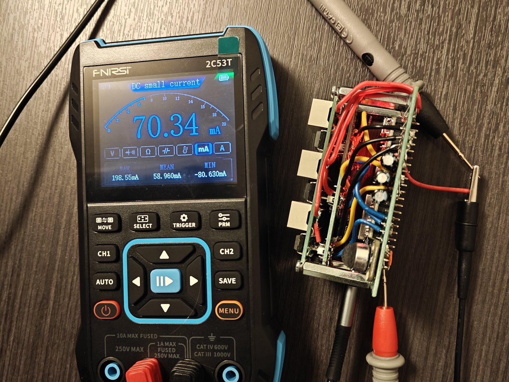
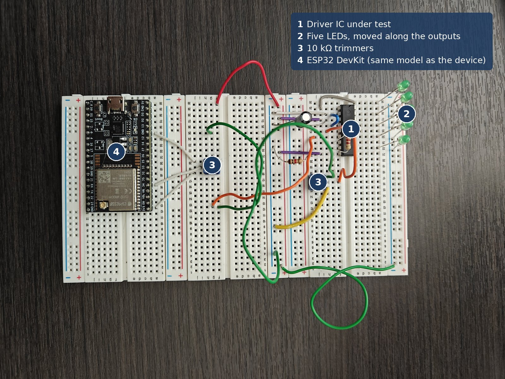
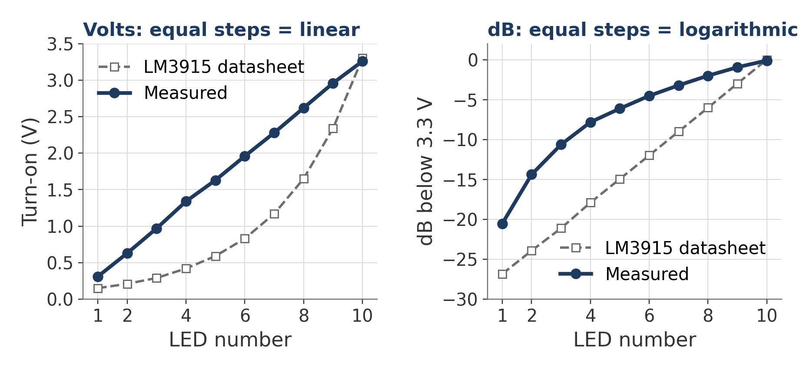
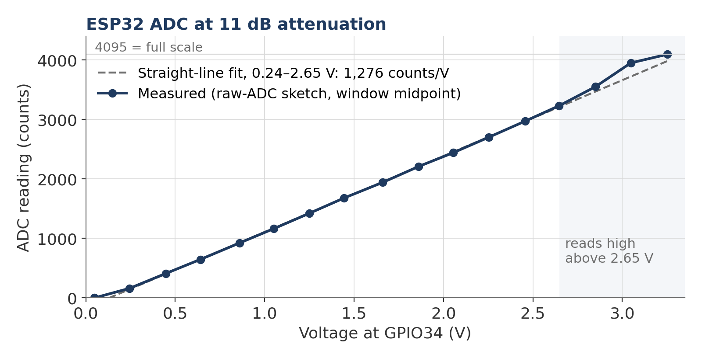
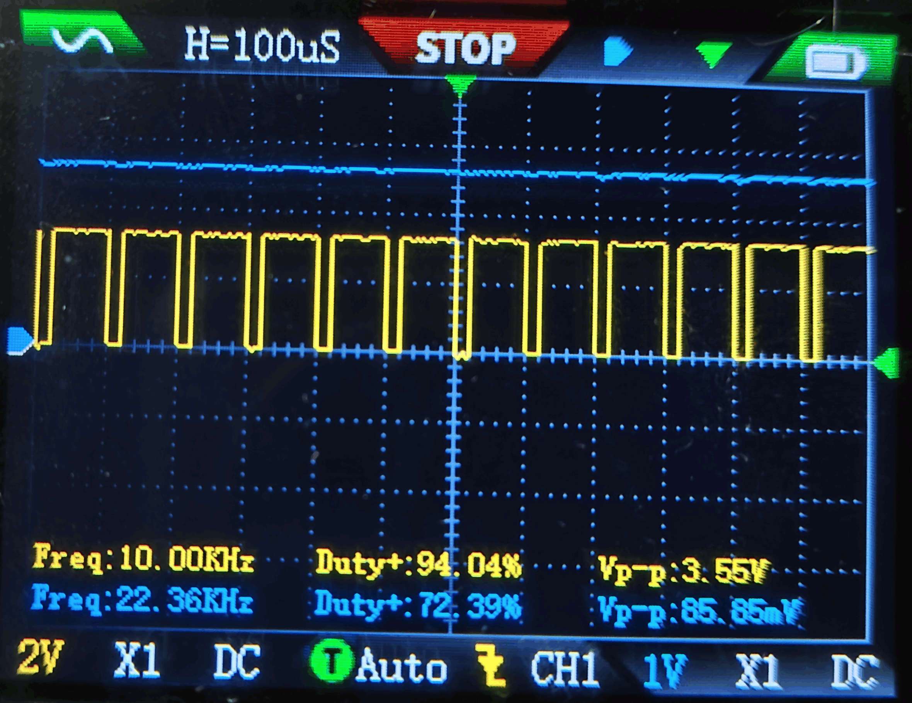
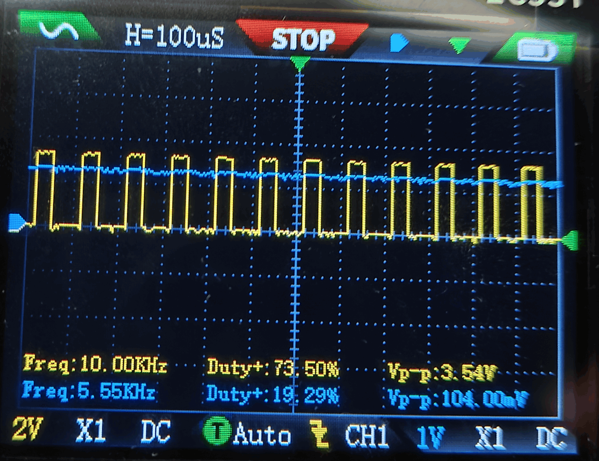

# Test

Every number here was measured on the bench, or is marked as calculated. The device measures sound only in relative terms and is not calibrated in decibels, so these tests check the circuit and the signal path, not the accuracy of the bars.



*The live reading, 70.34 mA with every bar dark, is the only value used. The MAX/MEAN/MIN row beneath it includes readings taken earlier with the leads on the wrong terminals.*

## Instruments

| Instrument | Used for |
|---|---|
| FNIRSI 2C53T handheld oscilloscope and multimeter, two 100 MHz ×1/×10 probes used at ×1 | DC voltage, DC current, PWM and filtered waveforms |
| The firmware's own serial status line | sample rate, frame rate, per-band levels and duty |
| The raw-ADC sketch, [adc_readout](../firmware/src/adc_readout/adc_readout.ino) | ADC counts for the gain setup and the ADC curve |
| An online tone generator through a JBL Clip 5 speaker, and music through the same speaker | the demonstration clips and all listening tests |

## Pass/fail summary

| Test | Requirement | Result | |
|---|---|---|---|
| Driver thresholds | logarithmic, as marked (LM3915) | evenly spaced, linear | **fail** — counterfeit; handled in firmware |
| Top LED | LED 10 lights at full scale on every bar | lights at 3.26 V, solid at duty 1023 on all three | pass |
| Microphone headroom | loud music stays clear of 0 and 4095 | 600–3,290 counts | pass |
| USB-C input | 5 V before connecting | 5.178 V | pass |
| Supply current | below the source rating (1 A recommended at design time) | 237.5 mA highest seen | pass |
| Sample rate | 32 kHz requested | 23.1 kHz achieved | accepted — see M5 |

## M1 · Driver thresholds

**Method.** The chips in the device are soldered in, so the test used a breadboard rig built for it: an ESP32, one driver chip, and five discrete LEDs moved along the driver's outputs to catch each of the ten switching points in turn. A comparator's threshold does not depend on which LED it drives. The driver's input (pin 5) was driven from a 10 kΩ trimmer across 3.3 V and ground, and the FNIRSI 2C53T on DC volts measured pin 5 to ground. Raising the trimmer slowly, the voltage was noted as each LED turned on. Full scale (RHI) was tied to 3.3 V and the bottom of the range (RLO) to ground, as in the device.

The three chips tested are the same counterfeit part as the ones in the device, and all three behaved the same.



**Results.** The three chips gave almost identical readings:

| LED | 1 | 2 | 3 | 4 | 5 | 6 | 7 | 8 | 9 | 10 |
|---|---|---|---|---|---|---|---|---|---|---|
| Measured turn-on (V) | 0.31 | 0.63 | 0.97 | 1.34 | 1.63 | 1.96 | 2.28 | 2.62 | 2.96 | 3.26 |
| Genuine LM3915, 3 dB steps (V) | 0.15 | 0.21 | 0.29 | 0.42 | 0.59 | 0.83 | 1.17 | 1.65 | 2.34 | 3.30 |
| Ideal linear, n × 0.33 V (V) | 0.33 | 0.66 | 0.99 | 1.32 | 1.65 | 1.98 | 2.31 | 2.64 | 2.97 | 3.30 |

The measured steps average 0.328 V (0.29 to 0.37 V), and no point sits more than 37 mV from a straight line. A logarithmic driver would multiply each threshold by about 1.41; here the ratio falls from 2.0 between LEDs 1 and 2 to 1.1 between LEDs 9 and 10, which is what a constant step looks like. The LM3915 row is calculated from 3.30 V down in 3 dB steps. The chips are linear parts marked as logarithmic ones.

LED 10 turns on at 3.26 V, 40 mV below the 3.3 V full scale; at duty 1023 it stays solid on all three bars.



*Read the two panels together. A linear chip steps by equal volts, so its thresholds are a straight line on the left. A logarithmic chip steps by equal decibels, so its thresholds are a straight line on the right. The measured chips are straight only on the left.*

## M2 · ESP32 ADC transfer curve

**Method.** On the same breadboard rig, the microphone was absent and a 10 kΩ trimmer across 3.3 V and ground drove GPIO34. The FNIRSI 2C53T on DC volts, reading to 0.1 mV, measured GPIO34 to ground. The raw-ADC sketch ran with the same settings as the firmware (12-bit, 11 dB attenuation), and at each step the window midpoint it printed was noted. Readings wandered by about ±15 counts.

The rig's ESP32 is the same model as the one in the device (ESP32-DevKitC-32UE) but a different board. ADC scaling varies from chip to chip, so the conversions of the device's own readings below are approximate.

| Volts | 0.049 | 0.244 | 0.447 | 0.641 | 0.859 | 1.051 | 1.249 | 1.445 | 1.659 |
|---|---|---|---|---|---|---|---|---|---|
| Counts | 0 | 160 | 410 | 646 | 922 | 1,163 | 1,420 | 1,680 | 1,940 |

| Volts | 1.862 | 2.054 | 2.253 | 2.456 | 2.647 | 2.850 | 3.048 | 3.253 |
|---|---|---|---|---|---|---|---|---|
| Counts | 2,210 | 2,440 | 2,700 | 2,970 | 3,230 | 3,550 | 3,950 | 4,095 |

From 0.24 to 2.65 V the readings fit 1,276 counts per volt within ±21 counts, crossing zero at about 0.13 V, so anything below that reads 0. Above 2.65 V the readings run high: 82 counts above the line at 2.85 V and 229 above it at 3.05 V. The ADC reads full scale, 4,095, by 3.25 V.

Converted with this curve, and so approximate for the device's own chip, the silent-room reading of about 1,940 counts is about 1.66 V, consistent with the microphone preamp idling at half of 3.3 V; loud music's 600–3,290 counts is about 0.60–2.69 V, so the highest peaks just reach the region where readings run high.



## M3 · Supply current

**Method.** The 5 V input was opened and the FNIRSI 2C53T inserted in series on its DC current range; music came from the speaker.

| State | Current at 5 V |
|---|---|
| Quiet room, every bar dark | 70.7 mA |
| Music at normal volume, about half the LEDs lit | 90–120 mA, highest seen 119 mA |
| Music as loud as possible, before the window settled; a few LEDs still unlit | 237.5 mA highest seen |

The 70.7 mA is the ESP32, the microphone and the three drivers' own consumption. At R1 = 2.2 kΩ each LED draws about 5.7 mA **[CALCULATED]**, so all 30 lit would add about 170 mA, about 241 mA in total, consistent with the highest reading. The device also ran from a USB power bank, whose display showed 0.0–0.3 A.

## M4 · PWM and the filtered voltage

**Method.** Channel 1 on GPIO27, the bass PWM; channel 2 on the bass driver's input (pin 5), after the 10 kΩ + 1 µF filter. Both probes at ×1; music playing; the display stopped to hold each capture. The question was whether the 10 kHz PWM is filtered out, leaving a steady level that follows the duty.



*Fig. 1 — FNIRSI 2C53T, 0.1 ms/div, CH1 GPIO27 2 V/div, CH2 bass driver pin 5 1 V/div, DC coupling, ×1 probes, Auto trigger, stopped.*



*Fig. 2 — same settings, a quieter moment in the music.*

**Results.** Channel 1 is a 3.3 V square wave (3.55 and 3.54 V peak-to-peak on the readout) at 10.00 kHz, the programmed frequency; twelve periods fill the twelve 0.1 ms divisions. In Fig. 1 the scope reads 94.04 % duty, and channel 2 sits flat at roughly 3 V, read from the graticule. In Fig. 2 the pulses are narrower and channel 2 sits flat at roughly 1.2 V. On both, the 10 kHz switching is gone from channel 2 at this scale.

Ignore the automatic duty readout in Fig. 2 (73.5 %). The scope takes a few seconds to settle its readings, and in that time the firmware moves the level with the music, so a low duty rarely stays put long enough to be read; the pulses in the trace are visibly under half a period wide. Channel 2's automatic frequency and duty readouts measure a line with no switching on it and mean nothing. The calculated ripple after the filter is about 5 mV (single pole, 15.9 Hz corner, 10 kHz), below what 1 V/div can show and far below the 330 mV between LEDs.

## M5 · Sample rate and frame rate

The firmware times each 1,024-sample block with `micros()`. Twenty-three consecutive status lines, with music playing and then paused, read 23,107 to 23,124 Hz and 19.6 frames per second. The loop requests 32 kHz, but each ADC read takes longer than the 31.25 µs slot, so this is the fastest the blocking loop can go. It was accepted; see [docs/design-decisions.md](../docs/design-decisions.md).

```
fs23118 19.6fps | B lvl 78.3 bot 71.0 top 81.0 d 746 | M lvl 60.3 bot 59.6 top 71.6 d  54 | T lvl 48.6 bot 49.1 top 55.9 d   0 |
fs23123 19.6fps | B lvl 66.7 bot 70.7 top 80.7 d   0 | M lvl 64.3 bot 58.6 top 70.6 d 481 | T lvl 54.4 bot 49.2 top 56.0 d 829 |
fs23114 19.6fps | B lvl 72.3 bot 69.2 top 79.2 d 315 | M lvl 66.0 bot 57.1 top 69.1 d 765 | T lvl 53.1 bot 49.1 top 55.0 d 755 |
fs23119 19.6fps | B lvl 81.6 bot 73.3 top 83.3 d 846 | M lvl 68.4 bot 58.6 top 70.6 d 836 | T lvl 46.5 bot 48.8 top 54.1 d   0 |
fs23116 19.6fps | B lvl 70.0 bot 70.6 top 80.6 d   0 | M lvl 70.4 bot 60.3 top 72.3 d 855 | T lvl 46.9 bot 48.9 top 53.6 d   0 |
fs23123 19.6fps | B lvl 58.2 bot 69.6 top 79.6 d   0 | M lvl 52.7 bot 59.3 top 71.3 d   0 | T lvl 47.2 bot 48.9 top 52.6 d   0 |
fs23117 19.6fps | B lvl 55.9 bot 67.6 top 77.6 d   0 | M lvl 51.6 bot 57.3 top 69.3 d   0 | T lvl 46.5 bot 48.7 top 52.2 d   0 |
fs23123 19.6fps | B lvl 58.0 bot 67.0 top 77.0 d   0 | M lvl 50.4 bot 56.7 top 68.7 d   0 | T lvl 47.0 bot 48.8 top 52.3 d   0 |
```

Eight of the 23 lines. After the music stops (the last three lines), every level drops below its window bottom and all duties go to 0. The bass and mid bottoms then fall 0.5 dB per line, because their windows hang from peaks that relax at 2.5 dB/s; treble's bottom holds at its noise floor.

## Microphone gain setup

The microphone gain trimmer cannot be set by ear, so it was set against the ADC. With the raw-ADC sketch running, music played louder than normal listening at the real microphone position gave a minimum and maximum of 600 and 3,290 counts with the trimmer at maximum. A close-range cough did clip at that setting, but a cough at point-blank range is not the use case; the real source at the real distance is. The trimmer was left at maximum.

## Not measured

The accuracy of the displayed levels was never measured, because the display is deliberately scaled per band for looks rather than calibrated. A frequency-accuracy test with a function generator injected into the ADC was out of scope for this build.
